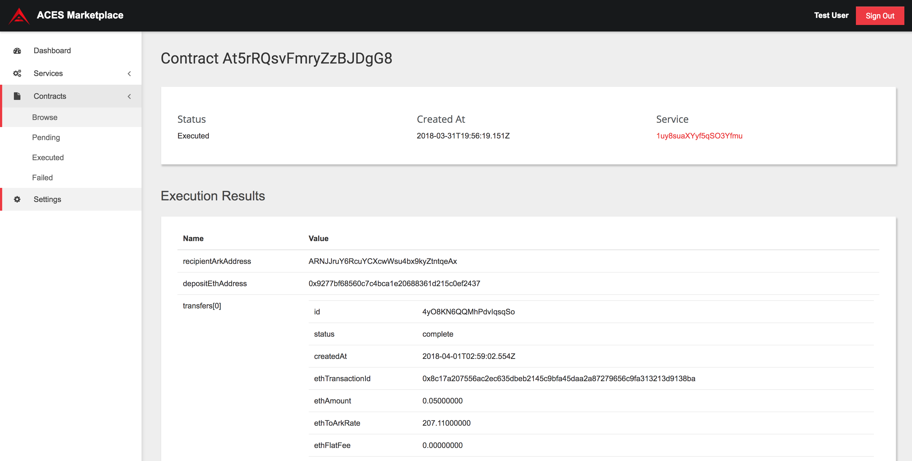

# ACES Marketplace

An open source platform for searching and executing ACES Service providers 
and tracking contract executions.

## Features

### Service Directory

The ACES Marketplace allows service providers to register services and have them 
discoverable by end consumers.

### Integrated Payments

The ACES Marketplace integrates an Ark payment wallet for easy service contract payments.

### Decentralized

The ACES Marketplace is Open Source and allows different instances to be created and managed 
by different organizations and use cases.

### Established Trust

The ACES Marketplace tracks and reviews services to establish trust for the consumer.

